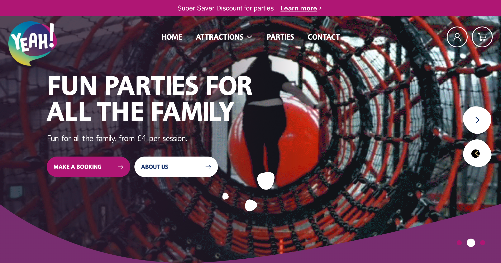

# Yeah! Days Out task for Impression Studio



<p>A web application for Yeah! Days Out built with <a href='https://nextjs.org/' target='_blank'>Next JS.</a></p>

## Technologies Used

### Languages

- [HTML5](https://en.wikipedia.org/wiki/HTML5)
- [CSS3](https://en.wikipedia.org/wiki/CSS)
- [JavaScript](https://en.wikipedia.org/wiki/JavaScript)

### Libraries and frameworks

- [Github](https://github.com/) - Where the repo for this project is located.
- [Git](https://git-scm.com/book/en/v2/Getting-Started-About-Version-Control) - Version control used throughout the development process.
- [NextJS](https://nextjs.org/) - React Framework used for server side rendering.
- [GSAP](https://greensock.com/) - JavaScript library used to implement animations on the menu and navbar dropdown.
- [Styled components](https://styled-components.com/) - To create styles throughout the application.
- [Studio Freight - Lenis](https://lenis.studiofreight.com/) - To implement smooth scrolling.

### Tools

- [react-click-away-listener](https://www.npmjs.com/package/react-click-away-listener) - Used to close the navbar dropdown when the user clicks outside of the element.
- [gray-matter](https://www.npmjs.com/package/gray-matter) - To parse the meta data of the markdown file.
- [react-swipeable](https://www.npmjs.com/package/react-swipeable) - To enable swiping on touch devices for the carousel component.

## 🛠 Installation & Set Up

1. Either clone or fork this repository and open it in your chosen text editor.

2. Install the dependencies

   ```sh
   npm install
   ```

3. Start the development server

   ```sh
   npm run dev
   ```
